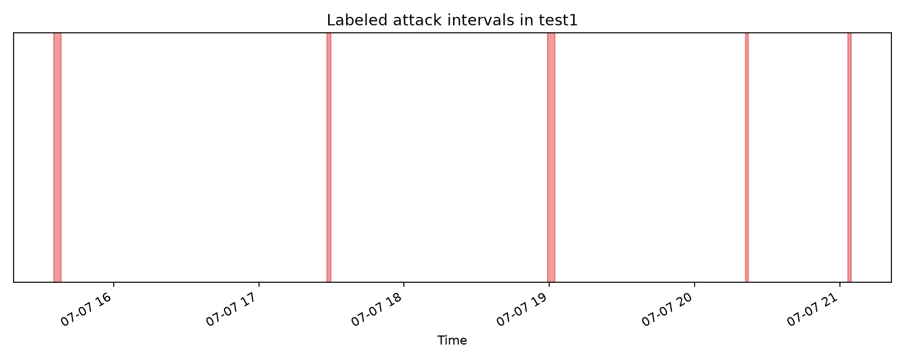

# Industrial Control System Anomaly Analytics

Eighteen SQL questions and an interactive dashboard for the [HAI 21.03 industrial control security dataset](https://github.com/icsdataset/hai). This project compares selected sensor readings with a normal training baseline, locates labeled attack episodes, and measures the workload created by simple deviation thresholds.

**Start with:** [Findings](FINDINGS.md) · [SQL questions](sql/) · [Results](results/) · [Dashboard screenshot](screenshots/dashboard.png)



## Run

```bash
python3 -m venv .venv
source .venv/bin/activate
pip install -r requirements.txt
python scripts/download.py
python scripts/build_db.py
python scripts/run.py
streamlit run dashboard.py
```

The downloader retrieves HAI 21.03 `train1.csv.gz` and `test1.csv.gz` from the [source repository](https://github.com/icsdataset/hai/tree/master/hai-21.03). These are a bounded release slice: 216,001 normal training seconds and 43,201 test seconds. Source files and DuckDB data stay under `data/` and are not committed. Committed SQL outputs and charts make the findings reviewable without a local download.

| Component | Details |
| --- | --- |
| Source | HAI 21.03 train1 and test1, one-second multivariate telemetry |
| Engine | DuckDB 1.x; eight selected sensor channels from P1 through P4 |
| SQL | 18 independent questions in `sql/` |
| Outputs | CSV and Markdown in `results/`, PNG in `charts/` |
| Dashboard | Streamlit + Plotly, sensor and hour selection |

## Method

For each selected sensor, `scripts/build_db.py` calculates the mean, standard deviation, and 1st/99th percentiles from normal training rows. `scores` exposes absolute z-score and an outside-range flag for every reading. The basic alert score at each second is the **maximum** absolute z-score across eight sensors. Thresholds are evaluated against the test labels in [query 09](sql/09_threshold_tradeoff.sql).

The SQL also covers attack episode timing, targeted subsystems, sensor distributions, correlations, threshold tradeoffs, and data quality. This is an interpretable baseline, not a validated plant security detector; process state and temporal dependence can make simple z-scores misleading.

## Source and license

HAI is maintained by the HAI dataset authors and released under [CC BY-SA 4.0](https://github.com/icsdataset/hai#license). Cite the original HAI work when reusing the data. This repository does not redistribute the source dataset. Original code here is MIT licensed; see [LICENSE](LICENSE).
